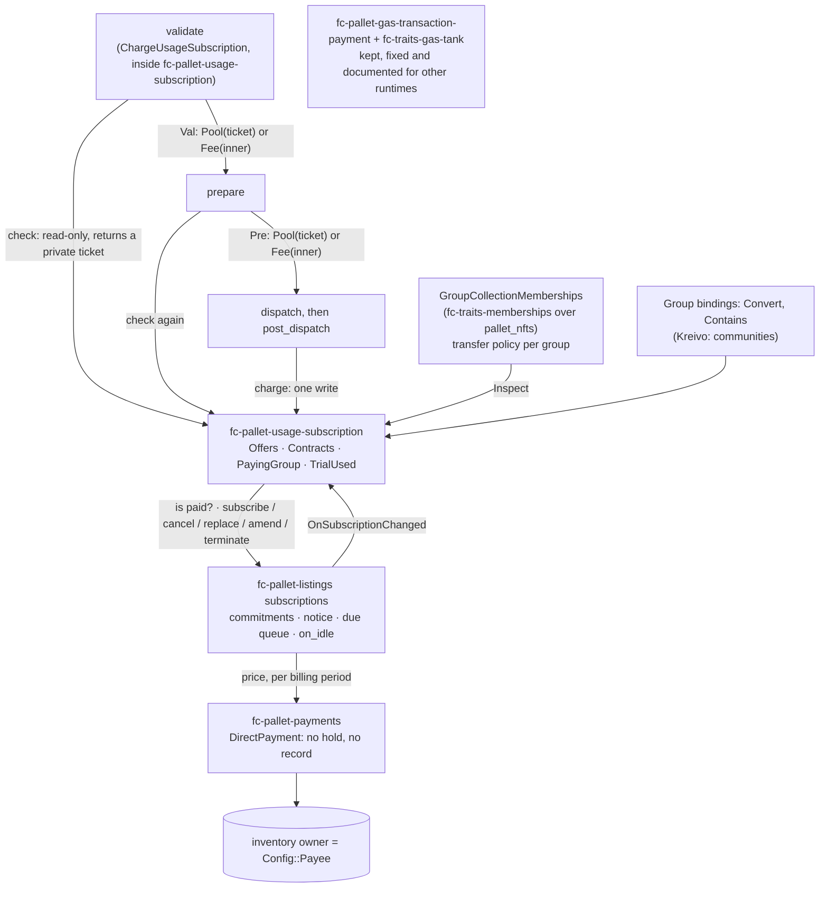

# Usage subscriptions — Implementation Plan (frame-contrib)

> **This is the frame-contrib part of the usage-subscriptions plan, `PLAN.md` v0.9.0.** It keeps every decision,
> binding, test and milestone that concerns frame-contrib's crates, verbatim, and leaves out what binds one runtime:
> Kreivo's facts and live state (§1.3, §1.5), its runtime wiring (§4.5, §4.6), its migrations (§6.2–§6.5), its
> milestone `M-3` and features (`F-00`, `F-07a`, `F-07b`, `F-08`, `F-09`, `F-10`, `F-12`), its dependencies (§9) and
> the transition from its current chain (§12). Decisions that only bind Kreivo are listed by identifier, so numbering
> stays stable. Identifiers such as `0002-A15` name the owner's review rulings (amendments), which are recorded with
> the specification's working documents. `SPEC.md`, beside this file, is the normative specification; where they
> disagree, `SPEC.md` wins.

# Usage subscriptions — Implementation Plan

This plan says **how**. `SPEC.md` says what. If they disagree, `SPEC.md` wins, and the fix is an amendment in
`amendments/` first. Every feature, decision and milestone here traces to a `US`, `REQ`, `CTR`, `INV` or `NFR`.
Amendment 0001 (the owner's review) renamed the system, ruled the first blocking questions, and redesigned
memberships around the group that owns them. Amendment 0002 (the second review) ruled the rest, made trial
conversion opt-in and custom amendments unilateral with safeguards, kept the gas-tank payment step (fixed and
documented) beside a new one inside `fc-pallet-usage-subscription`, and moved every value out of this plan.
Amendment 0003 (the third review) closed the last open questions, replaced grandfathering with a one-time deposit
reallocation, moved `UsageSubscription` to index 17, protected billing across migrations, allowed offer-level
amendments, and made `SPEC.md` purely normative. Amendment 0004 replaced the targeted call filter with the
memberships manager owning every membership collection (`DEC-36`); `SPEC.md` did not change. Amendment 0005 closed
the remaining plan-level rulings: the reallocation's last 26 amounts, the track's values, the collective's members,
and `ListingsCatalog`'s force origin (`DEC-37`). Amendment 0006 confirmed `DEC-12`, `DEC-17`, `DEC-22`, `DEC-34` and

**This plan is the home of every technical decision** (0003-A7). `SPEC.md` holds only normative requirements, and
each deployment's documents hold its values. A technical decision found anywhere else is moved here, with a pointer
left behind.

**This plan names `Config` items and gives no values.** Each deployment chooses its own values (0002-A8).

## 0. How to read this document

| Prefix | Meaning |
|---|---|
| `DEC-*` | A technical decision: what, the alternatives, why, the cost, and how reversible it is |
| `F-*` | A feature: a bounded unit of work. Its exit criterion names spec identifiers |
| `M-*` | A milestone: features that together make a claim true |
| `RISK-*` | A risk, with its mitigation |
| `DEP-*` | Something we are waiting on (an owner ruling, or the state of a branch), and what we plan in the meantime |

Identifiers follow the spec's rule: never renumbered; a withdrawn one stays with a note.

Source references are `repo@ref:path:line`.

| Short | Means |
|---|---|
| `fc2` | `virto-network/frame-contrib` `release/v2` at `6d4a6f8` (2.3.1) |
| `fc3` | `main` at `f95b25e` (3.0.0-pre.2) |
| `k17` | `virto-network/kreivo` `master` at `3e0a5c3` (tag 0.17.0) |
| `k505` | `test/gas-tank-lifecycle` at `5100261` (kreivo#505) |
| `nfts43` | `pallet-nfts` 43.0.0 (crates.io source) |
| `fcm` | `fc-traits-memberships` 2.3.1 (crates.io source, identical to `fc2:traits/memberships`) |
| `live` | Kreivo on Kusama, block #39 078 795 (finalised, 2026-09-30), read-only over an SSH tunnel |
| `live2` | Kreivo on Kusama, blocks #39 095 577–#39 095 919 (2026-10-01, `spec_version` 133), read with PAPI and JSON-RPC over an SSH tunnel |
| `tp49`, `fs48`, `fsup48`, `sw36`, `ref49`, `sr48` | `pallet-transaction-payment` 49.0.0, `frame-system` 48.0.0, `frame-support` 48.1.0, `sp-weights` 36.0.0, `pallet-referenda` 49.0.0, `sp-runtime` 48.0.0: the crates.io versions `k17`'s lockfile pins (polkadot-sdk stable2606) |

`dev` on GitHub (`a83fc25`) is stale: stable2603, frame-contrib from git. So Kreivo paths are cited from `k17`, the
shape 0.18 inherits (`DEP-6`, confirmed).

---

## 1. Ground truth: what exists today

### 1.1 The per-membership gas tank, and why it breaks

Every defect below that lives in frame-contrib is fixed in place by `DEC-23` (0002-A15). The crates stay.

| Fact | Where |
|---|---|
| `GasBurner { check_available_gas(who, estimated) -> Option<Gas>; burn_gas(who, expected, used) -> Gas }`. Plus `GasFueler`, `GasTank`, `MakeTank` | `fc2:traits/gas-tank/src/lib.rs:11-56` |
| `NonFungibleGasTank` keeps a `WeightTank` in the item attribute `membership_gas`, and a pre-dispatch note in `mbmshp_pays_gas` | `fc2:traits/gas-tank/src/impl_nonfungibles.rs:19-20, 22-28` |
| **Reset bug.** `if now - since > period { since = now + period; … put }`. This runs inside `check_available_gas`, so it writes during validation | `…/impl_nonfungibles.rs:105-109` |
| Validation also writes the `mbmshp_pays_gas` note | `…/impl_nonfungibles.rs:111-118` |
| `F::owned(who).find_map(...)` walks every item the account owns. It is unbounded, in validation | `…/impl_nonfungibles.rs:91` |
| The extension calls `check_available_gas` in `validate` **and again** in `prepare`. When `prepare` finds none, it calls the inner `prepare` with `val.expect("value was given on validate; qed")`, which panics because validation took the gas path and never ran the inner `validate` | `fc2:pallets/gas-transaction-payment/src/extensions.rs:97-111, 143-157` (expect at `:150`) |
| **Accounting bug.** `post_dispatch_details` returns `used_gas` as *unspent* weight, so `post_info.refund(used_gas)` takes the call's whole weight off the extrinsic's recorded weight | `extensions.rs:184-190`. Refund semantics: `frame-support-48.1.0:src/dispatch.rs:617-621`, and `sp-runtime-48.0.0:src/traits/transaction_extension/mod.rs:399-410` |
| **Estimate/charge mismatch.** It admits on `info.call_weight`, but burns `post_info.actual_weight`. That value already includes every extension's weight, because `set_extension_weight` runs before `post_dispatch` | `extensions.rs:97, 184`. `sp-runtime-48.0.0:src/traits/transaction_extension/dispatch_transaction.rs:159-160` |
| The extension's `weight()` is the gas path's benchmark only. It never adds the inner extension's weight | `extensions.rs:77-79` |
| The wrapper is invisible in metadata (`TypeInfo` and `IDENTIFIER` are the inner extension's). Changing its behaviour is not client-visible | `extensions.rs:15-23, 72` |
| Kreivo binds `MembershipsGasTank = NonFungibleGasTank<…, RelaychainData, CommunityMemberships, …, MembershipIsNotExpired>` | `k17:runtime/kreivo/src/config/currency.rs:165-189` |
| **Expiration key bug.** Written as `&b"membership_expiration"` (unprefixed), read the same way, but `CopySystemAttributesOnAssign` looks keys up length-prefixed. Moot after 0001-A7 removes expiration | `k17:pallets/communities-manager/src/lib.rs:371`, `k17:…/config/currency.rs:169`, `k17:…/config/communities/memberships.rs:16-30` |
| **Leftover attributes.** `release` burns the item without clearing its attributes. Live has one leftover (§1.5) | `fcm:src/impl_nonfungibles.rs:143-155` |
| Test evidence for all four bugs | `k505:runtime/kreivo/src/tests/membership_gas_tank.rs:459-464` (expiry), `:557-574` (reset), `:598-614` (panic and lock-out), `:651-656` (leftovers) |

### 1.2 Listings, orders and payments: the recurring-payments verdict

**Verdict: partial in design, missing in implementation.**

| What | State | Where |
|---|---|---|
| Subscription traits (`InspectSubscription`, `MutateSubscription`), `SubscriptionConditions { price, period }`, `Subscription { price, next_renewal }`, termination and dispute types | **Declared only.** `SubscriptionConditions` and `Subscription` derive nothing. `activate`/`cancel`/`terminate` take no subscriber. `publish<Reason>` takes its `name` as `Reason`. Byte-identical on `fc3` | `fc2:traits/listings/src/item.rs:180-366` (no derives `:184-192`). Re-exported at `lib.rs:23` |
| `fc-pallet-listings` | Implements inventory and item traits only. **No** subscription implementation, storage, calls, scheduler or hooks | `fc2:pallets/listings/src/impls.rs:10-189`. Calls: `lib.rs:257-525` |
| `fc-pallet-orders` | One-off carts. Nothing recurring | `fc2:pallets/orders/src/types.rs:49-69` |
| `fc-pallet-payments` | An escrow per payment. Nothing recurring | `fc2:pallets/payments/src/impls.rs:51-99`, `types.rs:56-68` |
| Assets | Listings, orders and payments price only in `pallet_assets` assets (`FungibleAssetLocation`). KSM is Kreivo's native `Balances` | `k17:runtime/kreivo/src/config/listings_orders.rs:64-65`, `payments.rs:65`, `xcm_config.rs:110-114` |

So Epic E is new work in `fc-traits-listings` and `fc-pallet-listings` (`F-02`).

### 1.4 Memberships today

| Fact | Where |
|---|---|
| `Inspect<AccountId>`: `Group`, `Membership`, `user_memberships(who, maybe_group) -> Box<dyn Iterator>`, `is_member_of` (default: `user_memberships(who, Some(g)).next().is_some()`), `check_membership(who, m) -> Option<Group>`, `members_total(g)` | `fcm:src/lib.rs:24-46` |
| `InspectEnumerable`: `group_available_memberships(g)`, `memberships_of(who, maybe_g)`. `Manager`: `assign(g, m, who)`, `release(g, m)`. `Rank`: `rank_of`, `set_rank`, `ranks_total` | `fcm:src/lib.rs:48-119` |
| `NonFungiblesMemberships`: `Group = CollectionId`, `Membership = ItemId`. `user_memberships(who, Some(g))` is `owned_in_collection(g, who)`; with `None` it is `owned(who)`. Both are lazy `KeyPrefixIterator`s, one read per `next()` | `fcm:src/impl_nonfungibles.rs:28-37`; `nfts43:src/impl_nonfungibles.rs:471-507` |
| `check_membership` scans every item the account owns | `fcm:src/impl_nonfungibles.rs:39-41` |
| **Assign** transfers the manager item (collection 0) to `ASSIGNED_MEMBERSHIPS_ACCOUNT` and mints a twin with the same id in the group's collection. **Release** sets rank 0, burns the twin, and transfers the manager item back to the group's owner | `fcm:src/impl_nonfungibles.rs:14, 129-155` |
| Stock is "items of collection 0 owned by the group's collection owner" | `fcm:src/impl_nonfungibles.rs:56-66` |
| `add_member` takes the **first item the community account owns in any collection**, not via `group_available_memberships` | `fc2:pallets/communities/src/lib.rs:425-440` |
| `remove_member(who, membership_id)` checks that `who` is a member of the community, but **not** that `who` holds `membership_id` | `fc2:pallets/communities/src/lib.rs:448-465` |
| `vote`/`remove_vote` resolve the community from the membership id alone (`check_membership`); votes are keyed `(poll, membership_id)` | `fc2:pallets/communities/src/lib.rs:532-580`, `functions.rs:75-140` |
| `pallet_nfts::do_transfer` refuses if `Locker` locks the item, if the `TransferDisabled` system attribute is set, if the collection has `TransferableItems` off, or if the item has `Transferable` off. `do_burn` checks the first two. Every check applies to trait-level transfers and burns too | `nfts43:src/features/transfer.rs:59-80`, `features/create_delete_item.rs:208-217` |
| `Transfer::disable_transfer`/`enable_transfer` set and clear the `TransferDisabled` system attribute (`Pallet` namespace, which no signed caller can clear) | `nfts43:src/impl_nonfungibles.rs:412-444` |
| `burn` keeps attributes. `Mutate::clear_attribute` works on a burnt item and decrements the collection's attribute count | `nfts43:src/features/create_delete_item.rs:208-269`, `features/attributes.rs:285-345`, `impl_nonfungibles.rs:353` |
| `lock_collection` disables collection settings for good ("it's possible only to lock the setting, but not to unlock it after"). Community accounts own and administer their collections, so a group admin can do this today | `nfts43:src/features/lock.rs:24-50`, `k17:pallets/communities-manager/src/lib.rs:292-301` |
| Kreivo's `CommunityMemberships`: `CreateOrigin = Root → TreasuryAccount`, `ItemDeposit = ()`, `AttributeDepositBase = ()`, `Locker = ()` | `k17:…/config/communities/memberships.rs:36-71` |
| Kreivo's `communities-manager` has **no storage**. The store lives entirely in `pallet_nfts<Instance2>` | `k17:pallets/communities-manager/src/lib.rs` |

## 2. Shape of the solution



| Crate | Line | Change | Bump (owner's rule: breaking = client-visible) |
|---|---|---|---|
| `fc-traits-gas-tank` | 2.x, 3.x | **Kept and fixed** (`DEC-23`): `NonFungibleGasTank` writes nothing in its check, computes its window, and bounds its scan. `GasBurner` gains two provided methods (*reworded by 0009-A13*). Integration guide (`F-11`) | Minor (2.4.0). Additive only |
| `fc-pallet-gas-transaction-payment` | 2.x, 3.x | **Kept and fixed** (`DEC-23`): the decision travels in `Val`, `PathMismatch` instead of the panic, metered estimate, correct unspent weight, declared weight covers the inner extension. Integration guide (`F-11`) | Patch-eligible (no API or metadata change); ships with 2.4.0 unless the owner wants 2.3.2 |
| `fc-traits-listings` | 2.x, 3.x | Real subscription types and traits: subscriber, term limit, minimum commitment, *Defaulted*, amendment, replacement, zero price, hooks | Minor. Nobody implements them today |
| `fc-pallet-listings` | 2.x, 3.x | Subscriptions: storage, calls 8–14, due queue, `on_idle`, events. New `Config` items | Minor (additive) |
| `fc-traits-payments`, `fc-pallet-payments` | 2.x, 3.x | New `DirectPayment` trait and its implementation: a direct payment, no hold, no stored record, one event (`DEC-5`) | Minor (additive) |
| `fc-traits-memberships` | 2.x, 3.x | New `GroupCollectionMemberships` implementation, `memberships::Transfer` trait and per-group transfer policy (`DEC-17`, `DEC-26`). `NonFungiblesMemberships` deprecated in 2.4.0, removed in 3.x | Minor (additive in 2.x) |
| `fc-pallet-communities` | 2.x, 3.x | `add_member` takes from the group's stock; `remove_member` checks the holder; new calls 12 `transfer_membership` and 13 `set_transfer_policy`; public `community_state` | Minor (additive calls; `Config` bound) |
| **`fc-pallet-usage-subscription`** | 2.x, 3.x | New pallet, with its own payment-step `TransactionExtension` (`DEC-24`) and its guide | Minor (new pallet) |

---
## 3. Decisions

**`DEC-1` One new pallet in frame-contrib, generic over a group.**
*Decision:* `fc-pallet-usage-subscription` (`pallets/usage-subscription`, runtime alias `UsageSubscription`) lands
in frame-contrib `release/v2` first. It holds offers, contracts, paying-group choices and the trial register, and it
carries its own payment-step extension (`DEC-24`; *reworded by 0002-A15*: it no longer implements `GasBurner`). It
knows groups only through `fc_traits_memberships::Inspect<AccountId>` plus two bindings,
`GroupAccount: Convert<Group, AccountId>` and `UsableGroup: Contains<Group>` (`REQ-GR-1`–`REQ-GR-3`), and billing
only through the subscription traits. *Alternatives:* a bespoke `MembershipFacts` trait (v0.1; withdrawn by 0001-A6);
Kreivo's own `pallets/`. *Why:* the owner's principle that anything outside Kreivo is decoupled. It also makes the
pallet testable in a mock runtime with no communities. *Cost:* two one-line Kreivo bindings. *Reversibility:* high.
Traces: Epics A–D, `CTR-CALL`, `CTR-QRY`, `CTR-EVT`, `CTR-MEM`.

**`DEC-2` Admission is read-only and ticketed: reshape `GasBurner`.** *Withdrawn by 0002-A15.*
Was: reshape `fc-traits-gas-tank`'s `GasBurner` around a ticket (`check_available_gas(who, estimated) ->
Option<Ticket>`, `burn_gas(ticket, used)`), and rebuild `fc-pallet-gas-transaction-payment` around it. The owner
ruled that the gas crates stay and are fixed in place (`DEC-23`), and that usage subscriptions get their own
extension. The ticket design survives, private, inside `fc-pallet-usage-subscription` (`DEC-24`).

**`DEC-3` Usage windows are computed, not reset.**
*Decision:* a contract stores `anchor`, `usage_period`, `window_start` and `used`. The current window start is
`anchor + ((now − anchor) / U) · U`, and `used` counts only if the stored `window_start` equals it. The
extension's post-dispatch charge is the only writer: it sets `window_start` and `used` in one `mutate`. An amended
allowance is stored with the window start it applies from (the first window starting at or after the amendment's
effective boundary, `DEC-28`), and admission reads
whichever allowance applies to the current window (`REQ-CT-8`). All arithmetic is `checked_*` or `saturating_*`.
Usage storage is constant per contract: one `window_start` and one `used`, overwritten when a new window begins; no
history of past windows is kept. A contract has at most one pending allowance: in its single `pending` slot (custom
contracts) or in its offer's single `OfferAmendment` record (standard contracts, `DEC-34`), never both. *Sentence added
by 0006-A3.*
*Why:* `INV-5` by construction; admission stays read-only (`INV-1`). *Reversibility:* high.
Traces: `REQ-PL-1`–`REQ-PL-5`, `INV-4`, `INV-5`, `INV-14`.

**`DEC-4` Billing is Listings subscriptions. Offers are subscription items.**
*Decision:* an offer is a listings item in the collective's inventory, with `SubscriptionConditions` (price, billing
period, term limit, minimum commitment, grace). Its weight terms and kind live in `UsageSubscription::Offers`. A
contract is the listings subscription keyed `(inventory, item, subscriber = group account)`, plus
`UsageSubscription::Contracts[group]`, which copies the weight terms (`INV-9`). Kind rules (standard open-ended,
trial limited and once per group, custom single-use) are enforced by `fc-pallet-usage-subscription` before it calls
`subscribe`. *Why:* the recurring machinery is generic. *Cost:* two pallets share one lifecycle through hooks
(`OnSubscriptionChanged`). *Reversibility:* medium.
Traces: Epic E, `REQ-OF-*`, `REQ-CT-*`, `REQ-BL-*`, `REQ-SB-*`.

**`DEC-5` Recurrence lives in listings; each charge is a direct payment through `fc-pallet-payments`.** *Reworked
by 0002-A20* (was: a plain transfer, outside payments).
*Checked:* `fc-pallet-payments` has no recurring charges, on `release/v2` or on `main`, and no branch, issue or PR
covers them. It does have a non-escrow path: `request_payment` then `accept_and_pay` transfers the amount directly
and settles fees through `FeeHandler` (`fc2:pallets/payments/src/lib.rs:360-436, 523-546`). The trait-level
`fc_traits_payments::Mutate::create` holds funds (`fc2:pallets/payments/src/impls.rs:51-90`, through
`reserve_payment_amount`), so it is not that path. Finished payments are never removed from storage; only a
cancellation removes a record (`lib.rs:463-464`).
*Decision:*
- Listings subscriptions own the recurrence (`DEC-6`). Each period's charge calls a new, additive trait
  `fc_traits_payments::DirectPayment<AccountId>: Inspect<AccountId>` with one method, `pay(sender, asset, amount,
  beneficiary, details) -> Result<Id, DispatchError>`.
- `fc-pallet-payments` implements it with `accept_and_pay`'s steps in one call: `FeeHandler::apply_fees`, the
  sender's fees, the amount transferred with `Preservation::Preserve` (never held), the beneficiary's fees,
  `OnPaymentStatusChanged::{on_payment_charge_success, on_payment_released}`, and an event `PaymentDirect { id,
  sender, beneficiary, asset, amount, fees }`. It keeps no `Payment` record, so recurring charges do not grow storage.
  Additive: a new trait, a new event, no change to existing calls or storage (minor).
- A zero price makes no payment (`REQ-BL-7`). A failed payment moves nothing (`REQ-BL-5`).
- Kreivo binds listings' `Payments = Payments`, and binds payments' `Assets` and `AssetsHold` to the same union as
  `DEC-11` (`UnionOf<Balances, Assets, …>` and `UnionOf<Balances, AssetsHolder, …>`; `UnionOf` implements
  `fungibles::Mutate` and `MutateHold`, `fsup48:src/traits/tokens/fungible/union_of.rs:513-612`), so KSM charges go
  through payments. Today payments takes `Assets` only (`k17:runtime/kreivo/src/config/payments.rs:65-66`).
- **Fees.** Kreivo's `KreivoFeeHandler` already waives the 1 % sender fee when the sender is a community account,
  but charges the 3 % beneficiary fee to any non-community beneficiary, the Treasury included, paid to the Treasury
  (`k17:runtime/kreivo/src/config/payments.rs:18-53`). It gains one rule: no fee on either side when the beneficiary
  is the configured payee. So a charge moves exactly the price (`REQ-BL-3`).
*Alternatives:* a plain transfer outside payments (the v0.2 choice; the owner wants charges tied to the payments
system); `Mutate::create` and `release` each period (an escrow hold and two steps, for no protection a prepaid
subscription needs). *Cost:* a new trait and a fee-handler rule; payments' asset binding widens to KSM for every
payment. *Reversibility:* high.
Traces: `REQ-BL-3`, `REQ-BL-5`, `REQ-BL-7`, `INV-10`.

**`DEC-6` Due charges: a bucketed queue, processed in `on_idle`, with lead.** *Confirmed by the owner (0002-A21).*
*Decision:* each live subscription sits in `DueQueue[bucket(due − lead)]`, with buckets of `DueBucketSize` ticks.
A due tick at which a pending amendment takes effect is queued at `bucket(due)`, with no lead (`REQ-CT-14`).
A *Defaulted* subscription sits in the bucket of its commitment end, where `on_idle` ends and removes it
(`REQ-CT-12`). `on_idle` walks buckets ≤ the current one from a cursor, processing at most `MaxChargesPerBlock`
entries and weighing every empty bucket read. `charge_due` is permissionless (`REQ-BL-4`). Pool usability never
depends on the queue (`REQ-CT-4`), and a *Defaulted* record past its commitment end never blocks a subscription
(`REQ-CT-12`), so a late queue can only delay bookkeeping. *Alternatives:* `on_initialize` (mandatory weight in
every bundled block) or `pallet_scheduler` (one agenda per subscription per period). *Cost:* renewals can be late
under sustained full blocks (`RISK-3`). *Reversibility:* high.
Traces: `REQ-BL-4`, `REQ-SB-4`, `NFR-3`.

**`DEC-7` Paying group: a stored choice, else the only group** (`OQ-1` resolved by 0001-A9).
*Decision:* `UsageSubscription::PayingGroup[account]`, set by `set_paying_group` (`DEC-21`). On a miss, the pallet
reads `T::Memberships::user_memberships(who, None).take(MaxMembershipScan + 1)`. If the iterator yields at most
`MaxMembershipScan` items, all of one group, that group is the answer. Anything else, including hitting the bound,
means none (`REQ-PC-2`, `REQ-PC-3`). The group account never appears, because `GroupCollectionMemberships` excludes a
collection's owner from its own memberships (`DEC-17`). *Why:* bounded (`NFR-1`), and it never guesses.
*Reversibility:* high.

**`DEC-8` The collective is listings merchant 0, and the configured payee owns its inventory.** *Reworked by
0001-A8, and again by 0002-A2 and 0002-A11.*
*Decision:* `fc-pallet-usage-subscription` lazily creates inventory `(CollectiveMerchant, USAGE_INVENTORY)`, owned by
`T::Payee::get()`, on the first `publish_offer`, so every charge goes to the configured payee (`DEC-5`). Kreivo sets
`CollectiveMerchant = 0`, because community 0 is the collective (0002-A11), and `Payee = TreasuryAccount`. Kreivo's
listings `SubscribeOrigin` refuses merchant 0, so usage contracts only go through `UsageSubscription::subscribe`.
`UsableGroup` refuses group 0 (`REQ-GR-4`). *History:* v0.1 reserved merchant 0 on the premise that 0 "can never be
a registered community"; 0001 found community 0 registered on live and moved the reservation to 65 535; the owner
then ruled that 0 is reserved to the collective at Kreivo level, so 0001's move is reverted, and
`communities-manager` reserves no id. *Cost:* none beyond the `SubscribeOrigin` and `UsableGroup` checks.
*Reversibility:* medium.

**`DEC-9` The fate of the old interfaces, per line.** *Reworded by 0002-A15: nothing in the gas crates is removed.*

| Line | `fc-traits-gas-tank`, `fc-pallet-gas-transaction-payment` | `fc-traits-memberships` | Kreivo |
|---|---|---|---|
| fc 2.3.2 (optional) | The extension's fixes 1–4 only (`DEC-23`), if the owner wants them before 2.4.0 | Unchanged | — |
| fc **2.4.0** | All of `DEC-23`: fixed in place, additive only. Integration guide (`F-11`) | `GroupCollectionMemberships`, `memberships::Transfer` and the transfer policy added. `NonFungiblesMemberships` and `ASSIGNED_MEMBERSHIPS_ACCOUNT` `#[deprecated]` | — |
| fc **3.x** (`main`) | Same fixes and guide, ported | `NonFungiblesMemberships` removed | — |
| Kreivo 0.17.x | — | — | Keeps the tank and the store. Tanks are unused on chain |
| Kreivo **0.18** | Not used: `ChargeGasTxPayment` replaced by `ChargeUsageSubscription` (`DEC-24`); `GasTxPayment` removed (`DEC-25`) | — | `MembershipsGasTank`, `MembershipIsNotExpired`, `TankConfig`, `create_memberships`, `set_gas_tank`, the genesis memberships, `CopySystemAttributesOnAssign`, `WELL_KNOWN_ATTR_KEYS` and `MakeTank` all removed |

Release notes say so (`REQ-RT-3`).

**`DEC-17` The memberships manager owns items in the group's own collection.** *Confirmed by 0006-A1.* *Reworded by 0004-A1: the collection
owner is the manager account (`DEC-36`), so the group account comes from the group binding.*
*Decision:* add `GroupCollectionMemberships<NF, ItemConfig, GroupAccount, ManagerAccount>` to `fc-traits-memberships`,
where `GroupAccount: Convert<CollectionId, AccountId>` names the account that holds a group's stock and
`ManagerAccount: Get<AccountId>` the account that owns every collection, implementing `Inspect`,
`InspectEnumerable`, `Attributes`, `Manager`, `Rank` and a new trait:

```rust
/// Moves a membership between holders, as its group's policy allows (REQ-MI-9, REQ-MI-15).
pub trait Transfer<AccountId>: Manager<AccountId> {
    fn transfer_policy(group: &Self::Group) -> TransferPolicy;
    fn set_transfer_policy(group: &Self::Group, policy: TransferPolicy) -> Result<(), DispatchError>;
    fn transfer(group: &Self::Group, m: &Self::Membership, to: &AccountId) -> Result<(), DispatchError>;
}
```

| Method | Behaviour |
|---|---|
| `user_memberships(who, Some(g))` | Empty if `who` is `GroupAccount(g)` (`REQ-MI-13`); else `owned_in_collection(g, who)` |
| `user_memberships(who, None)` | `owned(who)`, skipping items of any collection c where `who == GroupAccount(c)` (no read: the binding is a conversion, `REQ-GR-2`) |
| `group_available_memberships(g)` | `owned_in_collection(g, GroupAccount(g))`: the stock |
| `assign(g, m, who)` | `m` must be in the stock. `enable_transfer`, `transfer` to `who`, `disable_transfer`. Rank 0. `member_total` + 1 |
| `release(g, m)` | The holder must not be the group account. Rank 0 (adjusting `rank_total`). Unlock, transfer to `GroupAccount(g)`, relock. `member_total` − 1 |
| `transfer(g, m, to)` | Reads `g`'s policy (`DEC-26`). *Disabled*: refuse. *Existing members*: `to` must hold a membership of `g`. *Any account*: any `to`. Never the group account. Rank 0 or kept, per the policy. Unlock, transfer, relock. Totals unchanged |

No collection 0, no twin, no `ASSIGNED_MEMBERSHIPS_ACCOUNT`. *Alternative:* change `NonFungiblesMemberships` in
place, which silently changes behaviour for every runtime on 2.4.0. *Why:* additive in 2.x; Kreivo switches at the
upgrade that migrates its data. *Reversibility:* high.

**`DEC-18` Item-layer lock; no blanket call filter.** *Reworded by 0002-A23: the call filter is withdrawn.*
*Decision:* every membership item carries the `TransferDisabled` system attribute (`nfts43:src/impl_nonfungibles.rs:421-443`),
set at mint and after every manager move. `do_transfer` and `do_burn` refuse locked items (`nfts43:src/features/transfer.rs:63-66`,
`features/create_delete_item.rs:214-217`), so a holder, a delegate or a buyer cannot move or burn one; the manager
unlocks, acts and relocks within one call. **Kreivo sets no filter on `CommunityMemberships` calls.** 0001's
`BaseCallFilter`, which refused every such call for non-Root origins, is withdrawn: memberships are bound to their
community, the community issues and retires its stock, and members transfer under its policy, through origins of
their own (`DEC-31`). The audit of every `pallet_nfts` call found that what a member or any signed
account can still call is harmless under the lock; ten calls reachable by the community account, as its collection's
Owner, Admin, Issuer and Freezer, are not. *Closed by 0004-A1*: the community account holds no collection role any
more; the manager account does (`DEC-36`). *Alternatives:* the blanket filter (withdrawn by the owner); a targeted
filter (`DEC-32`, withdrawn by 0004-A1); `CollectionSetting::TransferableItems` off
(blocks the manager too, and cannot be undone); `ItemSetting::Transferable` (the Freezer could toggle it); a stateful
`Locker`. *Cost:* one attribute per item. *Reversibility:* high.

**`DEC-21` `set_paying_group` is feeless for members, rate-limited.**
*Decision:* call 6 `set_paying_group(Option<Group>)` carries `#[pallet::feeless_if(|origin, group| …)]`, true when
the signer holds a valid membership of the named group (or, for `None`, of the group it had named) and
`PayingGroup[who].changes < MaxPayingGroupChanges` in the current rate window (`now / PayingGroupChangeWindow`).
Kreivo's `SkipCheckIfFeeless` then skips the payment step entirely, so the call costs nothing and touches no pool.
`PayingGroup[who] = { group, window, changes }`. *Alternatives:* `Pays::No` declared on every call (a free spam
channel); a transaction-extension payload (refused by the owner). *Reversibility:* high.

**`DEC-22` Listings carries commitments, defaults, amendments and zero prices.** *Confirmed by 0006-A1.*
*Decision:* `SubscriptionConditions` gains `term: Option<u32>` and `min_commitment: Option<u32>`;
`SubscriptionState` gains `Defaulted { until }`; `Subscription` gains `pending_conditions`. A charge of zero skips
the transfer. `cancel` before the commitment end records the cancellation and keeps charging until it. A lapse before
the commitment end becomes `Defaulted`, queued at the commitment end (`DEC-6`). `amend(inv, item, who, conditions)`
stores `pending_conditions` with its `effective_at` (`DEC-28`), refused if the billing period changes; the due
tick at `effective_at` is charged with no lead; `cancel` while `pending_conditions` is set waives the commitment
and ends at `paid_through` (`REQ-SB-13`). `cancel_replacement(inv, item, who)` drops a scheduled replacement
(`REQ-SB-12`). Hooks gain `on_defaulted`, `on_amended` and `allow_replacement` (`DEC-27`). *Why:* the lifecycle is
money and time, so it belongs to the generic capability (SPEC §4.2). *Reversibility:* medium: the types freeze with
2.4.0. *Reworded by 0002-A1 and 0002-A14.*

**`DEC-23` Keep the gas crates, and fix them in place.** *Added by 0002-A15.*
*Decision:* `fc-pallet-gas-transaction-payment` and `fc-traits-gas-tank` stay, `NonFungibleGasTank` included. Each
fc-side defect of §1.1 is fixed where it is:

| # | Fix | Where | Rust API |
|---|---|---|---|
| 1 | **Validation and preparation agree.** `Val = Option<S::Val>` keeps its type: `None` already means "the burner was chosen". `prepare` on `None` checks again and, if the burner no longer covers the transaction, returns `InvalidTransaction::Custom(PATH_MISMATCH)`. On `Some(v)` it prepares the inner extension with `v` and never asks the burner again. No `expect` | `fc2:pallets/gas-transaction-payment/src/extensions.rs:129-171` | Unchanged |
| 2 | **Unspent weight.** `post_dispatch_details` on the burner path returns `Weight::zero()` (the extension's own unspent weight, none measured), never `used_gas` | `extensions.rs:184-193` | Unchanged |
| 3 | **Estimate and charge measure the same thing**, as `CheckWeight` does (0002-A4): the estimate is `info.total_weight() + base_extrinsic`, plus `len` as proof size; the charge is `post_info.calc_actual_weight(info) + base_extrinsic`, plus `len`, capped at the estimate | `extensions.rs:97, 144, 184` | Unchanged; tanks drain by the full metered weight |
| 4 | **Declared weight** is `charge_transaction_payment() + self.0.weight(call)`, so it covers the fee path too. `WeightInfo` keeps its one function, re-benchmarked to cover check plus burn | `extensions.rs:77-79` | Unchanged |
| 5 | **`NonFungibleGasTank` writes nothing in its check.** The window start is computed, `since + ((now − since) / period) · period`, and `used` counts only inside it; `>` becomes `≥`. The paying-item note (which item pays, under a per-account key) is written in preparation, through a new provided method `GasBurner::prepare_gas(who, estimated)`, whose default calls `check_available_gas`, so every other implementor is unaffected. `burn_gas` reads the note in O(1), rolls that item's stored window and adds the usage, so the tank that admitted the transaction pays for it whatever dispatch did to the signer's items; a second provided method, `GasBurner::cancel_gas`, drops the note when the transaction pays no fee (*reworded by 0009-A13*). The scan takes at most `MaxScan` items, a new type parameter with a default | `fc2:traits/gas-tank/src/lib.rs:16-29`, `impl_nonfungibles.rs:74-149` | **Additive**: two provided trait methods and a defaulted type parameter |

*Version.* Fixes 1–4 change no public item. Fix 5 adds three items, all defaulted: a minor under SemVer and under the
owner's rule. So `F-01` ships in **2.4.0** and the next `3.0.0-pre.N`. If the owner wants the extension fixed sooner,
1–4 can go out alone as **2.3.2**. Nothing here is client-visible: the extension's metadata is the inner one
(`extensions.rs:15-23, 72`). *Known limit withdrawn by 0009-A13:* the burn reads the paying-item note, so a call that moves the item, or gives the
signer an earlier-sorting one, during dispatch no longer escapes its charge. Usage subscriptions use a ticket (`DEC-24`).
*Alternatives:* the ticket reshape (`DEC-2`, withdrawn by the owner); removal (refused by the owner).
*Reversibility:* high.

**`DEC-24` The usage-subscription payment step is a `TransactionExtension` inside `fc-pallet-usage-subscription`.**
*Added by 0002-A15; confirmed by 0003-A5.*
*Decision:* `pallet_usage_subscription::ChargeUsageSubscription<T, S>(pub S, PhantomData<T>)` wraps a generic inner
extension `S` (Kreivo: `ChargeAssetTxPayment`), which handles the fee path.

- `Val = Path<Ticket, S::Val>` and `Pre = Path<Ticket, S::Pre>`, where `enum Path<P, F> { Pool(P), Fee(F) }` and
  `Ticket = { who, group, membership, window_start, estimated }` is private to the crate. The membership is in it
  for `DEF-1`.
- `validate`: if the origin is signed, compute the estimate (`REQ-PL-6`: `total_weight + base_extrinsic`, plus `len`
  as proof size) and run the read-only check, in `REQ-PL-7`'s order, each step returning early: resolve the group
  (`DEC-7`), the membership (`user_memberships(who, Some(group)).next()`), `UsableGroup::contains`, the contract and
  its subscription's `paid_through`, then the window arithmetic. A ticket means `Pool(ticket)`, default priority, no
  inner validation. None means `Fee(inner.validate(…))` (`CTR-FEE-3`).
- `prepare` on `Pool(t)`: check again; `Some(t') == t` gives `Pre::Pool(t)`, anything else
  `InvalidTransaction::Custom(PATH_MISMATCH)` (`ERR-PathMismatch`, `CTR-FEE-4`). On `Fee(v)`: `inner.prepare(v, …)`.
  No `expect` anywhere.
- `post_dispatch_details` on `Pool(t)` with `Pays::Yes`: actual = `calc_actual_weight + base_extrinsic`, plus `len`,
  capped at `t.estimated`; one `Contracts::mutate`; event `UsageCharged { group, who, weight, remaining }`
  (`CTR-EVT-2`); return `Weight::zero()` (`CTR-FEE-5`, `INV-11`). On `Fee(p)`: the inner one.
- `weight()` = max(`pool_path`, `fee_path_check` + `self.0.weight(call)`) (`CTR-FEE-6`).
- **Transparent in metadata, verified achievable:** `IDENTIFIER = S::IDENTIFIER`, `Implicit = S::Implicit`,
  `TypeInfo` with `Identity = S` returning `S::type_info()`, and `metadata()` forwarding `S::metadata()`, as the gas
  wrapper does (`fc2:pallets/gas-transaction-payment/src/extensions.rs:15-23, 72`). The default `metadata()` builds
  its entry from `IDENTIFIER` and the type's `TypeInfo` (`sr48:src/traits/transaction_extension/mod.rs:260-266`), and
  the derived codec of a newtype with `PhantomData` is the inner value's. So the transaction encoding does not change
  for clients. A test asserts that the runtime's metadata and an extrinsic's bytes are identical with either wrapper.

*Alternatives:* a separate crate, `fc-pallet-usage-subscription-transaction-payment` (two crates, two `WeightInfo`s,
and a public trait between them to carry the ticket); reusing the gas wrapper with a `GasBurner` implementation (needs
the reshape the owner withdrew, and makes the ticket public). *Why inside:* one crate, one `WeightInfo`, a private
ticket, no public surface to misuse. *Cost:* the pallet depends on `TransactionExtension` machinery. *Reversibility:*
high.

**`DEC-26` The transfer policy is a system attribute on the group's collection.** *Added by 0002-A13; confirmed by
0003-A5.*
*Decision:* `fc-traits-memberships` defines `TransferPolicy { receivers: Disabled | ToExistingMembers | ToAnyAccount,
rank: Reset | Keep }`, `Default` = `Disabled` with `Reset`. `GroupCollectionMemberships` stores a group's policy as
one `Pallet`-namespace system attribute (`membership_transfer_policy`) on the group's collection; an absent attribute
reads as the default. `transfer` reads it once. `fc-pallet-communities` adds call 13 `set_transfer_policy(policy)`,
`AdminOrigin`, event `TransferPolicySet`. *Cost:* one storage item per group that sets a policy, and one read per
transfer. *Alternatives:* a map in `fc-pallet-communities` (communities only; spaces would need their own); a field
in `fc-pallet-usage-subscription` (the wrong owner). *Why:* the manager is the only path that moves memberships
(`DEC-18`), and storing the policy on the collection keeps it generic over groups. *Reversibility:* high.

**`DEC-27` A trial's conversion is a replacement scheduled at subscription.** *Added by 0002-A1.*
*Decision:* `subscribe(offer, converts_into: Option<OfferId>)`. For a trial with `Some(target)`, the pallet checks
that the target is open, not a trial, and eligible (`ERR-InvalidConversion`), then calls
`schedule_replacement(inv, trial_item, group_account, target_item)` and records `pending: Convert(target)`. At the
trial's end, listings asks `OnSubscriptionChanged::allow_replacement`, which `fc-pallet-usage-subscription` answers
from the target's current status and the group's eligibility; a refusal, or a failed first charge, drops the
replacement, the trial completes, and the pallet emits `ConversionDropped { reason }`. On success, `on_replaced`
copies the target's terms into the new contract, and the event's end reason is *converted*. `cancel_switch()` (call 8)
calls listings' `cancel_replacement`.

*Why `Option<OfferId>`, not `Option<Box<ContractKind>>`:*
1. A recursive, boxed type has no `MaxEncodedLen`, so it cannot be stored in bounded storage (`NFR-5`).
2. The target must be an existing offer the group is eligible for, checked at subscription and again at the trial's
   end; an id names one, and a kind does not.
3. Its terms are copied at conversion, as every contract copies its offer's terms when it starts (`INV-9`); embedding
   terms in the trial would freeze them too early.

*Reversibility:* high.

**`DEC-28` A dedicated amend origin and track, a notice period and a free exit.** *Added by 0002-A14.*
*Decision:*
- `fc-pallet-usage-subscription` `Config` gains `AmendOrigin: EnsureOrigin`. `amend_contract` accepts only it.
- Kreivo adds `pallet_custom_origins::Origin::UsageSubscriptionAmender`, appended as variant 4, and `KreivoReferenda`
  track 5, "Usage Subscription Amendments", routed from it in `track_for`. `AmendOrigin = EitherOf<EnsureRoot,
  UsageSubscriptionAmender>`. *Track structure, 0003-A2* (values in Kreivo's deployment document):
  - a **long confirm period**, because the collective's voting membership is very small and the change alters the
    balance of power between the collective and a group; it also sets the guaranteed notice, since the minimum time
    from submission to enactment is prepare + confirm + `min_enactment_period` (`ref49:src/lib.rs:1147-1150, 986,
    915-919`), and the decision period is only a ceiling;
  - a **steep approval curve** from 100 % to a floor above 50 %, and a **flat support threshold above 50 %** of the
    members of rank ≥ 1, so a single member changing its vote during confirmation stops the confirmation
    (`REQ-OF-8`). The support threshold carries that guarantee: approval is weighted by rank (`Linear`, excess rank
    + 1, `pallet-ranked-collective-49.0.0:src/lib.rs:236-241`), and on live one voting member has rank 4 and the
    other rank 1 (Virto, community 1, rank 4; Kippu, community 2, rank 1; Bloque is not a community yet: 0005-A4), so
    approval alone would not; support counts heads (`bare_ayes`, `:131-136`);
  - a swing aborts confirmation (`ConfirmAborted`), and the referendum keeps deciding; it is rejected when it is not
    passing after the decision period ends (`ref49:src/lib.rs:1215-1244`). A confirmation that starts in the second
    half of the decision period cannot be retried.
- Listings' `amend` computes `effective_at` = the first due tick b with b − now ≥ the billing period, that is
  `anchor + ⌈(now + B − anchor) / B⌉ · B`, and queues that tick with no lead (`DEC-6`, `REQ-CT-14`). While
  `pending_conditions` is set, `cancel` waives the commitment and ends at `paid_through` (`REQ-CT-15`).
- *Client-visible, additive:* a new origin variant and a new track (metadata, PAPI descriptors), and a new `Config`
  item. Encodings of existing items are unchanged.
- Offer-level amendments use the same origin and track (`DEC-34`).

*Alternatives:* reuse `UsageSubscriptionAdmin` (no separate, auditable path); require the group's acceptance (option
b, not chosen). *Reversibility:* high.

**`DEC-30` Multi-block migrations by default, for Kreivo and frame-contrib.** *Added by 0002-A22; confirmed by
0003-A6, which adds `DEC-35`.* **A project-wide
principle**, not only this feature's.
*Decision:*
- Every data migration, in Kreivo or in any frame-contrib pallet, is a `pallet_migrations` stepped migration
  (`SteppedMigration`): a cursor, a per-step weight and proof bound checked against the `WeightMeter` before each
  item, `pre_upgrade`/`post_upgrade` under try-runtime, and a storage-version gate. A one-block `OnRuntimeUpgrade` is
  allowed only for constant-size work (a version bump, removing a pallet whose prefix is known to hold a handful of
  keys).
- Kreivo wires `pallet_migrations` first (`F-12`): `frame_system::Config::MultiBlockMigrator = MultiBlockMigrations`,
  `CursorMaxLen`, `IdentifierMaxLen`, `MaxServiceWeight`, a `FailedMigrationHandler` that freezes the chain (as Asset
  Hub does), benchmarks on CCX43, and, in the same change, `Migrations` moved out of `Executive`'s deprecated sixth
  parameter into `frame_system::Config::SingleBlockMigrations` (`frame-executive-48.0.0:src/lib.rs:221-222`: "will
  be removed after September 2026").
- **What a step gets under bundling.** A step runs in place of `on_poll`, after inherents, and its weight is booked
  unchecked (`frame-executive-48.0.0:src/lib.rs:728-742`); its meter is `MaxServiceWeight`
  (`pallet-migrations-19.0.0:src/lib.rs:769`), which `integrity_test` keeps at or below `max_block` (`:556-562`). While
  a migration runs, `DynamicMaxBlockWeightHooks` requests the full core in every block
  (`cumulus-pallet-parachain-system-0.30.0:src/block_weight/pre_inherents_hook.rs:42-53`), so Kreivo builds one
  full-core block (2 s, 10 MiB) per relay slot instead of three. Outside a block, `max_block` is the ⅓-core target
  (666 666 666 666, 3 495 253 B, live), which bounds a constant `MaxServiceWeight`. The value (recommended: 80 % of the
  ⅓-core target) is in the deployment document.
- **What stops while it runs:** user transactions (only inherents are applied), `on_poll` and `on_idle`
  (`frame-executive-48.0.0:src/lib.rs:607-613, 732, 805-807`), and `set_code`. So the due queue pauses and no pool-path
  transaction can arrive; `on_initialize` and XCM inherents still run.
*Why Kreivo has no `pallet_migrations` yet:* history, not incompatibility. No commit, branch, issue or PR in
`virto-network/kreivo` or `frame-contrib` ever mentions it; `pallet-migrations` 19.0.0 is in `k17`'s lockfile only
through the emulated XCM tests' Westend runtimes; `MultiBlockMigrator` is the `()` default of
`ParaChainDefaultConfig`; every upgrade so far fitted one block (and before 0.17 a block had the whole 2 s); and
frame-contrib has never shipped a storage migration. Nothing in Kreivo's `Executive` or bundling setup prevents it:
cumulus already handles an ongoing migration (`ongoing_mbm_requests_full_core`,
`cumulus-pallet-parachain-system-0.30.0:src/block_weight/tests.rs:900`).
*Cost:* a new pallet in Kreivo, a short transaction outage while a migration runs (§6.4: about two relay slots).
*Reversibility:* high for the principle; each migration is low once applied, so `NFR-9` gates it.

**`DEC-31` The memberships manager's calls take origins of their own.** *Added by 0002-A23; confirmed by 0003-A5.*
*Decision:* the calls that act on membership items take configurable origins, bound at runtime level:
- `communities-manager` `Config` gains `GroupAdminOrigin: EnsureOrigin<RuntimeOrigin, Success = CommunityId>` for
  `issue_memberships` and `retire_memberships`. Kreivo binds `EitherOf<EnsureCommunity, EnsureCommunityAccount>`, the
  registered admin included.
- `fc-pallet-communities` `Config` gains `MemberOrigin: EnsureOrigin<RuntimeOrigin, Success = AccountId>` for
  `transfer_membership`; the pallet checks that the account holds the membership, and the manager applies the
  group's policy (`DEC-26`). Kreivo binds `EnsureSigned` (pass-authenticated accounts included). `set_transfer_policy`
  takes the existing `AdminOrigin`.
- Additive: new `Config` items (minor). *Reversibility:* high.

**`DEC-34` Offer-level amendments use the same amend origin and track, applied lazily per contract.** *Added by
0003-A8; the owner framed it as a plan decision. Confirmed by 0006-A1.*
*Decision:*
- New call 9 `amend_offer(offer, terms)`, `AmendOrigin` only, on the same `KreivoReferenda` track as `DEC-28`. It
  applies to open standard offers. The offer's terms (and its listings item's conditions) change at once for new
  subscriptions, and `OfferAmendment[offer] = { seq, terms, enacted_at }` is recorded; each contract stores the `seq`
  it has applied.
- **No loop over contracts.** A contract whose applied `seq` is below the offer's has the amendment pending, with its
  own effective boundary b computed from `enacted_at`, its anchor and its billing period (`REQ-CT-14`). The due queue
  reaches every contract at its due tick anyway (`DEC-6`): the charge for the period starting at b reads the
  amendment, charges the new price, copies the new terms, and advances the contract's `seq`. Admission reads the
  offer's amendment (one extra read, within `NFR-1`) and uses the new allowance for windows starting at or after b.
  `cancel` reads it too, for the free exit.
- **Safeguards per contract.** The notice period is counted against each contract's own boundaries. The free exit
  holds, though a standard contract has no commitment to waive, so it is an ordinary cancellation at `paid through`.
  No refunds.
- **Bounds.** All contracts on one offer share its billing period B, so every effective boundary is before
  `enacted_at + 2B`. A second offer amendment before then is refused with `ERR-ChangePending`. A switch requested
  while the amendment is pending for that contract is refused; a switch pending when it is enacted is dropped at its
  boundary with the reason.
- **Withdrawal.** Withdrawing the offer leaves its pending amendment in force for its contracts (`AC-A5.8`). The
  record may be removed after `enacted_at + 2B`.
- **Events.** `OfferAmended { offer, enacted_at, last_boundary }` once, at enactment; `ContractAmended { group,
  effective_at }` per contract when the new terms come into force.
*Alternatives:* amend each contract in one block (unbounded); a new contract per group (the anchor and commitment
would restart). *Reversibility:* high.

**`DEC-35` Billing across migration pauses.** *Added by 0003-A6; confirmed by 0006-A1.*
*Decision:*
- `fc-pallet-listings` implements `frame_support::migrations::MigrationStatusHandler`
  (`fsup48:src/migrations.rs:591-597`), and Kreivo wires it as `pallet_migrations::Config::MigrationStatusHandler`
  (called at `pallet-migrations-19.0.0:src/lib.rs:761, 832`). `started()` records `PauseStartedAt = now`;
  `completed()` adds `now − PauseStartedAt` to a cumulative `PausedTicks` and records `CatchUpFrom`.
- **Grace does not run during a pause.** When a subscription is suspended it stores the `PausedTicks` value of that
  moment; its grace end is `d + G + (PausedTicks − stored)`. O(1), no loop.
- **Catch-up first.** In the first blocks after a pause, `on_poll` (which runs after inherents and before
  transactions, and is skipped while a migration runs, `frame-executive-48.0.0:src/lib.rs:728-742`) processes the due
  buckets from `CatchUpFrom` to now, bounded by `MaxChargesPerBlock`, before `on_idle`'s regular processing; then
  clears `CatchUpFrom`.
- **Deployment constraint:** `RenewalLead` ≥ the longest expected migration pause plus a margin, so charges due in a
  pause are normally attempted before it begins.
- Billing boundaries, commitment ends and usage windows never move (`REQ-BL-8`, `INV-21`).
- **Rehearsal:** the Chopsticks run (`F-09`) schedules a stepped migration across a contract's due tick and a
  suspended contract's grace end, and checks `AC-D4.1`–`AC-D4.3`.
*Alternatives:* treat every tick as normal (a pause could suspend or lapse a group that could not pay); shift every
deadline by rewriting each subscription (a loop over all of them). *Reversibility:* high.

**`DEC-36` The memberships manager owns and administers every membership collection.** *Added by 0004-A1; replaces
`DEC-32`. Extended by 0006-A2: no call administers a membership collection; the manager account does, and Root
repairs. Group admins get no collection-level call (not even for metadata).*
*Decision:*
- **One keyless manager account** holds Owner, Issuer, Admin and Freezer of every membership collection. Kreivo
  derives it from a `PalletId` (deployment document) and binds it as `GroupCollectionMemberships`' `ManagerAccount`.
  Group accounts hold stock but no collection role (`DEC-17`).
- *Why one account, not one per group:* every deposit on `CommunityMemberships` is zero
  (`k17:runtime/kreivo/src/config/communities/memberships.rs:44-56`; live, every `owner_deposit` is 0), so no
  account needs funding; collections are created only by `communities-manager` at registration, through the `Create`
  trait (`k17:pallets/communities-manager/src/lib.rs:292-301`), so one argument changes; spaces reuse the same
  manager; a per-group account would be a second derivation controlled by the same code. Keyless, so no pre-signed
  mint or attribute write can carry a role holder's signature.
- **Instance origins.** `CreateOrigin = EnsureNever`, as `ListingsCatalog` has: no one creates a membership collection
  directly; `communities-manager` does, through the trait, with the manager account as owner and admin.
  `ForceOrigin = EnsureRoot` stays, for repairs (confirmed by 0005-A3; `ListingsCatalog` now matches, `DEC-37`).
- **No call filter.** The role-gated calls (`destroy`, `mint`, `force_mint`, `update_mint_settings`, `set_team`,
  `transfer_ownership`, `lock_collection`, `set_collection_max_supply`, `lock_item_transfer`, `lock_item_properties`,
  `redeposit` and the metadata calls) fail for everyone but the manager, which never signs, and Root on the force
  branches. Item-holder calls fail at the `TransferDisabled` lock (transfer, burn, buy, swap claim) or record state
  that can never complete (price, approval, swap). Item-holder attribute writes in the `ItemOwner` and approved
  `Account` namespaces stay possible and free, harmless to `INV-17`/`INV-18`. The full audit is in
  0004-A1.
- **Migration:** step M8 hands the 21 live collections to the manager (§6.3).
*Alternatives:* the targeted call filter (`DEC-32`, withdrawn); a pallet-derived account per group (no deposit to
separate, more derivations). *Cost:* community admins lose direct control of their collection's metadata and roles.
*Reversibility:* medium (a migration back).

Decisions that bind only Kreivo, and are kept in Kreivo's plan: `DEC-10`, `DEC-11`, `DEC-12`, `DEC-13`, `DEC-14`, `DEC-15`, `DEC-16`, `DEC-19`, `DEC-20`, `DEC-25`, `DEC-29`, `DEC-32`, `DEC-33`, `DEC-37`.

## 4. The binding

### 4.1 `fc-pallet-usage-subscription` (new, `pallets/usage-subscription`)

**Config**

| Item | Purpose |
|---|---|
| `WeightInfo` | Calls, plus `pool_path` and `fee_path_check` for the extension (`DEC-24`) |
| `Memberships: fc_traits_memberships::Inspect<AccountId> + fc_traits_memberships::Transfer<AccountId>` | `Group: MaxEncodedLen + Copy`, `Membership: MaxEncodedLen` (`REQ-GR-1`, `CTR-MEM-1`, `CTR-MEM-2`). `Transfer` is used read-only, for the `transfer_policy` view function (0008-A2) |
| `GroupAccount: Convert<Group, AccountId>` | `REQ-GR-2`, `CTR-MEM-4` |
| `UsableGroup: Contains<Group>` | `REQ-GR-3`, `CTR-MEM-3` |
| `Subscriptions: subscriptions::Inspect + subscriptions::Mutate` | The listings capability (`CTR-SUB`) |
| `OfferInventory: Get<(MerchantId, InventoryId)>` | `DEC-8`. Kreivo: merchant 0 |
| `Payee: Get<AccountId>` | Owner of the collective's inventory, so the recipient of every charge (`DEC-8`, 0002-A2). Replaces `OfferInventoryOwner`. Kreivo: `TreasuryAccount` |
| `StandardOfferOrigin` (also trials), `CustomOfferOrigin`, `TerminateOrigin` | `EnsureOrigin` (`DEC-10`) |
| `AmendOrigin` | `EnsureOrigin`, the only origin `amend_contract` accepts (`REQ-OF-8`, `DEC-28`) |
| `GroupOrigin: EnsureOrigin<Success = Group>` | The group's administrative origin for `subscribe`, `cancel`, `switch_offer` and `cancel_switch` (0002-A7). Kreivo: `EitherOf<EnsureCommunity, EnsureCommunityAccount>`, the registered admin included |
| `BlockNumberProvider` | The chain clock (`CTR-CLK-1`). Kreivo: `RelaychainData` |
| `MinUsagePeriod`, `MinBillingPeriod`, `MaxTrialPeriods`, `MaxMembershipScan` | `REQ-OF-2`, `REQ-OF-6`, `REQ-PC-3` |
| `MaxPayingGroupChanges`, `PayingGroupChangeWindow` | `REQ-PC-5`, `DEC-21` |
| `MaxOffersPerPage` | Page size of the `open_offers` view function (`CTR-QRY-1`, 0008-A1) |
| `BenchmarkHelper` | Sets up a group, members, an offer and a paid contract |

**Storage**

| Item | Type | Notes |
|---|---|---|
| `Offers` | `map OfferId → { kind: Standard \| Trial \| Custom(Group), allowance: Weight, usage_period, status }` | `OfferId` = the listings `ItemId` |
| `Contracts` | `map Group → { offer, kind, allowance, usage_period, anchor, window_start, used: Weight, pending: Option<Switch(OfferId) \| Convert(OfferId) \| Amend { allowance, effective_at, from_window }> }` | `INV-8`: one per group, kept while *Defaulted* |
| `PayingGroup` | `map AccountId → { group, window, changes }` | `DEC-7`, `DEC-21` |
| `TrialUsed` | `map Group → ()` | `REQ-OF-7`. Never removed |
| `OfferAmendment` | `map OfferId → { seq, terms, enacted_at }` | `DEC-34`. Each contract also stores the `seq` it has applied |

**Calls** (indices fixed from the first release): 0 `publish_offer(terms)`, 1 `withdraw_offer(offer)`,
2 `subscribe(offer, converts_into: Option<OfferId>)`, 3 `cancel()`, 4 `switch_offer(offer)`,
5 `terminate_contract(group)`, 6 `set_paying_group(Option<Group>)`, 7 `amend_contract(group, terms)`,
8 `cancel_switch()`, 9 `amend_offer(offer, terms)` (`DEC-34`). Behaviour is in `SPEC.md` §8.1. `charge_due` lives in listings.

**`ChargeUsageSubscription<T, S>`** (`src/extension.rs`): the payment-step extension of `DEC-24`. Its ticket is
private to the crate. Its integration guide is part of `F-11`.

**`OnSubscriptionChanged` for `Pallet<T>`.**

- `on_ended`: remove `Contracts[g]` and emit `ContractEnded { reason }`.
- `on_defaulted`: keep `Contracts[g]`; emit `ContractDefaulted { until }`.
- `on_replaced`: rewrite the contract from the new offer, with anchor = the old `paid_through`; a trial with
  `Convert` pending ends *converted* (`DEC-27`).
- `allow_replacement`: refuse a conversion or switch whose target is withdrawn or no longer eligible, with the
  reason (`DEC-27`).
- `on_amended`: record the enactment and its effective boundary; at the boundary, move the pending allowance into
  force from its window (`DEC-28`).
- `on_suspended`, `on_restored`, `on_charged`: events only.

**View functions** (`#[pallet::view_functions]`, additive metadata), one per query of `CTR-QRY-1`:

| View function | Answers |
|---|---|
| `offer(offer)` | One offer's terms, kind and status |
| `open_offers(start_after: Option<OfferId>, limit: u32)` | Open offers in ascending `OfferId` order, after `start_after`, at most `min(limit, MaxOffersPerPage)` of them, plus the last id returned as the next cursor (`None` when exhausted). Iterates `Offers` from the cursor's key and skips withdrawn offers. Read-only and bounded, so a page never depends on the total number of offers (0008-A1) |
| `contract(group)` | §8.3's contract query |
| `pool(group)` | §8.3's pool query |
| `paying_group(account)` | The resolved paying group, with the reason (`REQ-PC-2`) |
| `trial_used(group)` | Whether the group has used its trial (`REQ-OF-7`) |
| `transfer_policy(group)` | The group's transfer policy, read through `Memberships::transfer_policy` (`DEC-17`); the policy itself stays a system attribute of the group's collection (`DEC-26`) (0008-A2) |
| `would_waive(account, estimate)` | The admission decision with its reason, never a bare boolean |

### 4.2 `fc-traits-listings` and `fc-pallet-listings` (subscriptions)

**Types.** `SubscriptionConditions { price, period, term: Option<u32>, min_commitment: Option<u32>, grace }`;
`Subscription { conditions, anchor, paid_through, periods_charged, state, cancel_requested, replacement:
Option<ItemId>, pending_conditions: Option<SubscriptionConditions> }`; `SubscriptionState { Active, Suspended {
since }, Defaulted { until } }`; `EndReason { Completed, Cancelled, Lapsed, Switched, Terminated }`.
`pending_conditions` carries its `effective_at` (`DEC-28`). All derive
`Encode, Decode, DecodeWithMemTracking, MaxEncodedLen, TypeInfo`.

**Traits.**
- `Inspect`: `subscription_conditions(inv, item)`, `subscription(inv, item, who)`, `is_paid(inv, item, who, now)`,
  `commitment_end(inv, item, who)`.
- `Mutate`: `set_conditions`, `subscribe(inv, item, who)` (charges period 0), `charge_due`, `cancel`, `terminate`,
  `schedule_replacement(inv, item, who, new_item)`, `cancel_replacement(inv, item, who)`,
  `amend(inv, item, who, conditions)` (effective after the notice period, `DEC-28`).

The dispute methods are kept but not implemented (`DEF-4`). `publish<Reason>` is replaced by `set_conditions` on
an existing item.

**Config additions:**

| Item | Purpose |
|---|---|
| `SubscribeOrigin: EnsureOriginWithArg<_, InventoryId, Success = AccountId>` | Who may subscribe directly |
| `Payments: fc_traits_payments::DirectPayment<AccountId>` | Each charge, as a direct payment (`DEC-5`). Same `AssetId` and `Balance` as `ItemPrice`. *Replaces `SubscriptionAssets` (0002-A20)* |
| `BlockNumberProvider` | The chain clock |
| `RenewalLead`, `DueBucketSize`, `MaxDuePerBucket`, `MaxChargesPerBlock` | `DEC-6`. Values: per deployment |
| `OnSubscriptionChanged` | Tuple-able hooks, `allow_replacement` included (`DEC-27`) |

**Storage:** `Subscriptions: NMap (inv, item, who) → Subscription` (a suspended subscription also stores the
`PausedTicks` of its suspension, `DEC-35`); `PauseStartedAt`, `PausedTicks`, `CatchUpFrom` (`DEC-35`); `DueQueue: map bucket → BoundedVec<key>`;
`DueCursor`.

**Calls (new indices):** 8 `set_subscription_conditions`, 9 `subscribe`, 10 `charge_due`, 11
`cancel_subscription`, 12 `terminate_subscription`, 13 `schedule_replacement`, 14 `amend_subscription` (merchant
origin), 15 `cancel_replacement` (subscriber).

**Hooks:** `on_idle` processes the due queue (`DEC-6`), *Defaulted* expiries included. `on_poll` processes the
catch-up after a migration pause first (`DEC-35`). `MigrationStatusHandler` records pauses (`DEC-35`).

Ended subscriptions are removed from storage after notifying. Changing an item's conditions never touches
existing subscriptions (`REQ-SB-1`).

### 4.3 `fc-pallet-gas-transaction-payment` and `fc-traits-gas-tank`

Kept and fixed in place, as `DEC-23` says (*reworded by 0002-A15*; this section followed the withdrawn `DEC-2`).
`WeightInfo` and `BenchmarkHelper` keep their shape; the benchmark is re-run so `charge_transaction_payment` covers
check plus burn. Each crate gains a crate-level guide (`F-11`). Kreivo stops using both (`DEC-25`), so Kreivo's
benchmark helper for them (`k17:…/currency.rs:230-250`) goes; the usage-subscription extension has its own
(`setup_member(who) -> estimate`).

### 4.4 `fc-traits-memberships` and `fc-pallet-communities`

- `fc-traits-memberships`: `GroupCollectionMemberships` and `memberships::Transfer` (`DEC-17`), with the item lock
  (`DEC-18`). The attribute keys become `pub const`. `NonFungiblesMemberships` is `#[deprecated]` in 2.4.0 and
  unchanged otherwise.
- `fc-pallet-communities`:
  - `Config::MemberMgmt` adds the `InspectEnumerable` and `memberships::Transfer` bounds (a Rust `Config` change:
    minor under the owner's rule).
  - `add_member` takes `group_available_memberships(&community_id).next()` instead of the account's first item in
    any collection (`fc2:pallets/communities/src/lib.rs:431`).
  - `remove_member` checks that `who` holds `membership_id` in the community before releasing it.
  - New call 12 `transfer_membership(membership_id, to)`, taking the new `MemberOrigin` (`DEC-31`; Kreivo: signed)
    and checking the caller holds the membership, calling `memberships::Transfer` (`REQ-MI-9`). Event
    `MembershipTransferred`.
  - New call 13 `set_transfer_policy(policy)`, `AdminOrigin`, calling `memberships::Transfer::set_transfer_policy`
    (`REQ-MI-15`, `DEC-26`). Event `TransferPolicySet`.
  - `pub fn community_state(id) -> Option<CommunityState>`.

---

## 5. Release lines and order of work

### 5.1 Features

| ID | Line | What | Exit criterion |
|---|---|---|---|
| `F-01` | fc `release/v2`, then `main` | **Fix `fc-pallet-gas-transaction-payment` and `fc-traits-gas-tank` in place, and write their integration docs (`F-11`)** (`DEC-23`; *reworded by 0002-A15*, was `DEC-2`'s reshape). Mock burner tests, and a `NonFungibleGasTank` test across a window boundary | `REQ-RT-8`, `AC-G2.2`; the gas path never writes in validation, never panics, reports no call weight as unspent, and declares the inner weight; both lines |
| `F-02` | fc `release/v2` | Listings subscriptions (§4.2, `DEC-22`, `DEC-27`, `DEC-28`, `DEC-34`, `DEC-35`), and the payments `DirectPayment` trait (`DEC-5`) | `US-E1`–`US-E5`, `REQ-SB-1`–`REQ-SB-14`, `REQ-BL-8`, `INV-8` (Subs part), `INV-10`, `INV-14`, `INV-20` and `INV-21` (Subs part) |
| `F-03` | fc `release/v2` | `fc-pallet-usage-subscription` (§4.1), with its payment-step extension (`DEC-24`), conversion, and contract- and offer-level amendments (`DEC-34`) | `US-A*`–`US-D*`, `CTR-FEE-*`, `INV-1`–`INV-9`, `INV-11`, `INV-13`, `INV-15`, `INV-20`; metadata and encoding identical with the inner extension alone |
| `F-04` | fc `release/v2` | Memberships redesign: `GroupCollectionMemberships`, `memberships::Transfer`, item lock, transfer policy (`DEC-17`, `DEC-18`, `DEC-26`). Communities: stock-based `add_member`, `remove_member` check, `transfer_membership`, `set_transfer_policy`, `community_state` | `AC-F3.1`, `AC-F4.1`–`AC-F4.6`, `US-F6`, `REQ-MI-13`, `REQ-MI-15`, `CTR-MEM-1`–`CTR-MEM-3`, `INV-17`, `INV-18` (item layer) |
| `F-05` | fc `release/v2` | Kitchensink wiring (replaces `fc2:kitchensink/src/configs.rs:205-221`, moves to `GroupCollectionMemberships`), `/cmd bench`, release **2.4.0** | Weights on CCX43. Published, tagged, GitHub release `--latest=false` |
| `F-06` | fc `main` | Port `F-01`–`F-05`, PR by PR, in the same session each lands (backport rule). Remove `NonFungiblesMemberships`. Implement `fc-pallet-fees`' `AccountCommunity` for `UsageSubscription` | Next `3.0.0-pre.N` via release-plz |
| `F-11` | fc `release/v2` and `main` | **Integration guides** (0002-A15), crate-level rustdoc mirrored in each crate's README: `fc-pallet-gas-transaction-payment` with `fc-traits-gas-tank` (lands with `F-01`), and `fc-pallet-usage-subscription`'s extension (lands with `F-03`). Each covers the burner or check contract (read-only, deterministic; the charge infallible), placement in `TransactionExtensions` (after `CheckWeight`, inside `SkipCheckIfFeeless`, around the fee extension), how the extension's declared weight and the benchmarks compose, what is metered (`REQ-PL-6`), and kreivo#505's pitfalls: writes in validation, `expect` in preparation, a window reset into the future, the call weight reported as unspent, admission on `call_weight` but charge on `actual_weight`, an undeclared inner weight, and an unbounded scan | Each pitfall has a doc test or a linked test in the crate; `cargo doc` builds with no broken links; reviewed by the owner |

Kreivo's features (`F-00`, `F-07a`, `F-07b`, `F-08`, `F-09`, `F-10`, `F-12`) are in Kreivo's plan.

### 5.2 Milestones

| ID | Claim | Features |
|---|---|---|
| `M-1` | frame-contrib 2.4.0 is published with usage subscriptions and their payment step, listings subscriptions, the group memberships manager, and the gas-tank payment step fixed and documented | `F-01`–`F-05`, `F-11` |
| `M-2` | The 3.x line matches 2.4.0 | `F-06` (with `F-01` and `F-11` on `main`) |

`M-3` (Kreivo 0.18) is in Kreivo's plan.

### 5.3 Order

1. No open question blocks the work (0002).
2. `F-01` (with its part of `F-11`) first, on both lines. It is small, and it removes the bug class from the gas
   crates on its own.
3. `F-02` and `F-04`, then `F-03` (which needs both).
4. `F-05`, then release 2.4.0. `release/v2` releases are **manual**: a release PR, `publish.sh`, a tag, and a
   GitHub release with `--latest=false`.
5. `F-06`: open each port as its 2.x PR merges. On `main`, if `cargo-semver-checks` raises the bump for
   `DEC-23`, use the Release workflow's "Skip semver check" input (frame-contrib#104).

**PR titles:**

- fc: `feat(fc-pallet-usage-subscription): …`, `feat(fc-pallet-listings): recurring subscriptions`,
  `feat(fc-traits-memberships): group collection memberships`, `feat(fc-pallet-communities): transfer within the
  group`, `fix(fc-pallet-gas-transaction-payment): …`, `fix(fc-traits-gas-tank): …`, `docs(…): integration guide`.
  No `!`.

---

## 6. Migrations

### 6.1 frame-contrib: no pallet-level migration

| Crate | Storage change | Migration |
|---|---|---|
| `fc-traits-memberships` | None: a trait crate. `GroupCollectionMemberships` reads and writes the runtime's `pallet_nfts` instance, so converting data is runtime-specific (§6.3) | None |
| `fc-pallet-communities` | None. `CommunityVotes` stays keyed `(poll, membership_id)`, and ids are preserved (`REQ-RT-5`) | None. Storage version unchanged |
| `fc-pallet-listings` | New items only (`Subscriptions`, `DueQueue`, `DueCursor`) | None. They start empty |
| `fc-pallet-usage-subscription` | New pallet | None |
| `fc-pallet-gas-transaction-payment`, `fc-traits-gas-tank` | None | None |

Kreivo's migrations (§6.2–§6.5) are in Kreivo's plan.

---

## 7. Benchmarks and weights

- **frame-contrib.**
  - `fc-pallet-usage-subscription`: every call, plus the extension's `pool_path` and `fee_path_check`: a member
    with no named group and `MaxMembershipScan` items, a usable group, an active contract, and a pool at its limit
    minus the estimate.
  - `fc-pallet-gas-transaction-payment`: `charge_transaction_payment`, re-run to cover check plus burn with a
    bounded `NonFungibleGasTank` scan (`DEC-23`).
  - `fc-pallet-listings`: calls 8–14, plus `process_due(n)` and `skip_empty_bucket`.
  - `fc-pallet-communities`: `add_member` and `remove_member` with the lock round-trip, `transfer_membership` (one
    policy read), `set_transfer_policy`.

  Run with `/cmd bench --pallet …` on the PR, on the CCX43 GARM pool. Never commit an unallowlisted `Weight::MAX`.
- `on_idle` charges are weighed per item and per empty bucket. `MaxChargesPerBlock` is chosen so a full batch
  stays under 10 % of a bundled block's normal `ref_time`; the value is in the deployment document.

---

## 8. Tests

| Level | What | Names |
|---|---|---|
| fc unit: usage subscription | One test per §5.2 row, `t_5_2_<from>_<to>_<when>`, *Defaulted* rows included. Properties: windows for random anchors, periods and clock skips (`INV-5`); usage never exceeds the allowance (`INV-4`). One test per `REQ-PL-7` condition failing. Ticket survives dispatch (`INV-13`). Trial once per group. Conversion: succeeds, charge fails, target withdrawn, cancelled, invalid at subscription (`US-B8`). Amendment: only the amend origin; the effective boundary for enactment 3 days before, at, and 1 day after a boundary (`AC-A5.4`); the free exit (`US-B9`); allowance from the first window at or after b (`INV-20`). Feeless `set_paying_group` within and beyond the rate limit. The extension's metadata and encoding equal the inner extension's | `inv_5_…`, `ac_b7_2_…`, `ac_a5_4_…`, `ac_b8_3_…`, `ac_c3_3_…` |
| fc unit: view functions | Each `CTR-QRY-1` query answers from one state and writes nothing (`REQ-OB-1`). `open_offers`: ascending order, the cursor resumes exactly after the last id, `limit` capped at `MaxOffersPerPage`, withdrawn offers skipped, `None` cursor at the end, and a page's cost independent of the total number of offers. `transfer_policy` equals the memberships manager's answer under each policy (0008) | `ctr_qry_1_open_offers_pages_by_cursor`, `ctr_qry_1_transfer_policy_reads_manager` |
| fc unit: payment steps | For `ChargeUsageSubscription` and, separately, the fixed gas extension: nothing is written in validation (`sp_io::storage::root` before and after: `INV-1`); a second answer that differs gives `PathMismatch` with no panic (`INV-2`, `INV-15`). Estimate 100, actual 10, so 10 charged (`INV-3`). `actual_weight` not reduced by the call weight (`INV-11`). `Pays::No` charges nothing. `NonFungibleGasTank` across a window boundary: admitted, no write in the check, no panic (`AC-G2.2`) | `inv_1_…`, `inv_11_…`, `ac_g2_2_…` |
| fc unit: listings | The lifecycle table, commitments and *Defaulted* included. Lead, grace, lapse. The replacement, its fallback, `allow_replacement` refusal and `cancel_replacement`. Amendment at `effective_at`, never charged early; cancel with the commitment waived while pending. Zero price. Queue order and bound. Notifications. No double charge (`INV-10`) | `ac_e3_2_…` |
| fc unit: memberships | Assign, release, transfer with the lock round-trip under each transfer policy, the default refusing; direct `pallet_nfts` transfer and burn refused (`INV-18`, item layer); a collection owner is never its own member (`REQ-MI-13`); `add_member` uses the stock | `ac_f4_3_…`, `inv_18_…` |

`k505`'s file documents the old system and goes away with it. Its scenarios live on as `AC-C2.2` and `AC-F3.2`.
Its disposition is the owner's (`DEP-7`).

---

---

## 10. Risks

| ID | Risk | Mitigation |
|---|---|---|
| `RISK-2` | The check adds reads and proof size to **every** signed transaction (`NFR-2`) | Bound the scan (`MaxMembershipScan`). Benchmark the worst case. State the delta in the release notes |
| `RISK-3` | `on_idle` starves when blocks stay full longer than `RenewalLead`, so renewals run late and pools pause | `charge_due` is permissionless. Set the lead with that in mind (deployment document). Monitor the queue's depth |
| `RISK-4` | `cargo-semver-checks` flags a change as major. *Reworded by 0002-A15*: with `DEC-2` withdrawn, the gas crates gain only defaulted items (`DEC-23`) | The owner's rule. "Skip semver check" (frame-contrib#104) on `main` if needed. Manual release on `release/v2` |
| `RISK-6` | The hash-ordered `owned()` scan reaches a group membership only after unrelated items | `CommunityMemberships` holds only membership items after the migration (collection 0 is empty). Over 4 items, the fee path is taken (`REQ-PC-3`) |
| `RISK-7` | Zero-cost pool-path transactions let one member drain a pool (SPEC §4.3) | Default priority. The group releases the member. `DEF-1` later |
| `RISK-8` | 2.x and 3.x drift | Port in the same session. A both-lines table in every status report |
| `RISK-13` | Groups do not set a transfer policy, and members who expect to transfer cannot | Release notes; communities UIs expose `set_transfer_policy` |

---

Kreivo's risks are in Kreivo's plan.

---

## 11. Traceability

| Feature | Serves |
|---|---|
| `F-01` | `REQ-RT-8`, `AC-G2.2` (the gas crates, fixed) |
| `F-02` | Epic E, `CTR-SUB-*`, `REQ-BL-*`, `REQ-CT-5`, `REQ-CT-8`–`REQ-CT-15` (money and time), `INV-8`, `INV-10`, `INV-14`, `INV-20`, `INV-21`, `NFR-3` |
| `F-03` | Epics A–D, `CTR-CALL`, `CTR-QRY`, `CTR-EVT`, `CTR-FEE-*`, `REQ-GR-*`, `REQ-OF-*`, `REQ-CT-*`, `REQ-PL-*`, `REQ-PC-*`, `REQ-TX-*`, `INV-1`–`INV-9`, `INV-11`–`INV-13`, `INV-15`, `INV-20` |
| `F-04` | `REQ-MI-4`, `REQ-MI-8`–`REQ-MI-10`, `REQ-MI-13`, `REQ-MI-15`, `CTR-MEM-*`, `INV-16`–`INV-18` |
| `F-05`, `F-06` | `NFR-4`, release scope |
| `F-11` | `REQ-RT-8`, `NFR-2` (the guide states what is metered and declared) |

---
